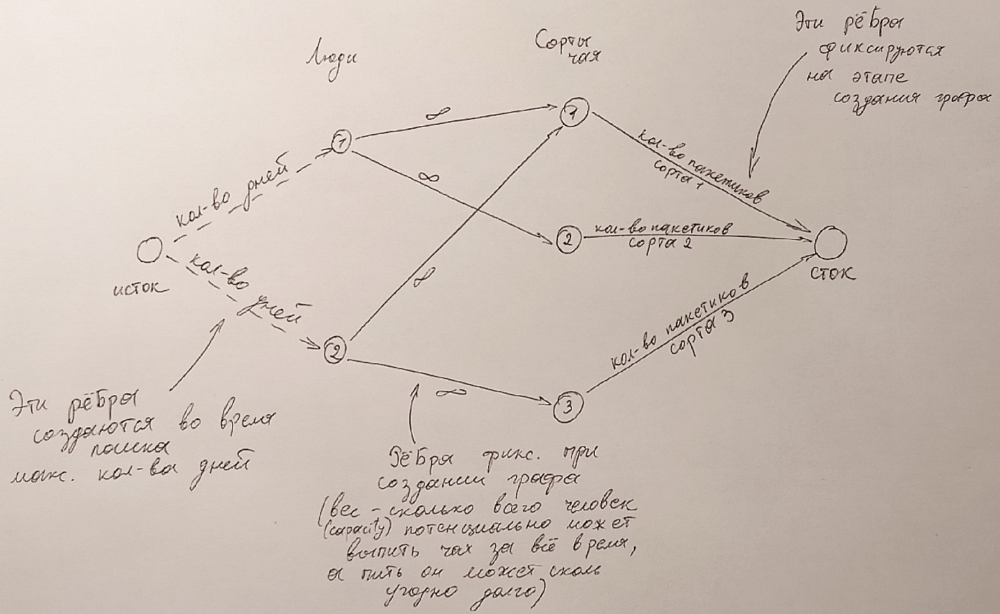

# Задача 4 (C в контесте)

### Условие
В одном из отделов крупной организации работает n человек. Как практически все сотрудники этой организации, они любят пить чай в перерывах между работой.
При этом они достаточно дисциплинированы и делают в день ровно один перерыв, во время которого пьют чай.
Для того, чтобы этот перерыв был максимально приятным, каждый из сотрудников этого отдела обязательно пьет чай одного из своих любимых сортов.

В разные дни сотрудник может пить чай разных сортов. Для удобства пронумеруем сорта чая числами от 1 до m.
Недавно сотрудники отдела купили себе большой набор чайных пакетиков, который содержит a_1 пакетиков чая сорта номер 1, a_2 пакетиков чая сорта номер 2, ..., a_m пакетиков чая сорта номер m.
Теперь они хотят знать, на какое максимальное число дней им может хватить купленного набора так, чтобы в каждый из дней каждому из сотрудников доставался пакетик чая одного из его любимых сортов.
Каждый сотрудник отдела пьет в день ровно одну чашку чая, которую заваривает из одного пакетика. При этом пакетики чая не завариваются повторно.

Первая строка содержит два целых числа n и m (1 <= n, m <= 50). Вторая строка содержит m целых чисел a_1, ..., a_m (1 <= a_i <= 10^6 для всех i от 1 до m).
Далее следуют n строк — i-я из этих строк описывает любимые сорта i-го сотрудника отдела и имеет следующий формат:
сначала следует положительное число k_i — количество любимых сортов чая этого сотрудника, а затем идут k_i различных чисел от 1 до m — номера этих сортов.
Выведите одно целое число — искомое максимальное количество дней.

### Решение
Используется поиск максимального потока из предыдущей задачи.

Вершины графа:

+ Люди
+ Сорты чая
+ Исток и сток

Бинарным поиском подбирается такое максимальное кол-во дней, что поток из истока в сток равен (кол-во дней * кол-во людей), т.е. такое кол-во дней, что каждый человек каждый из этих дней сможет пить чай.

